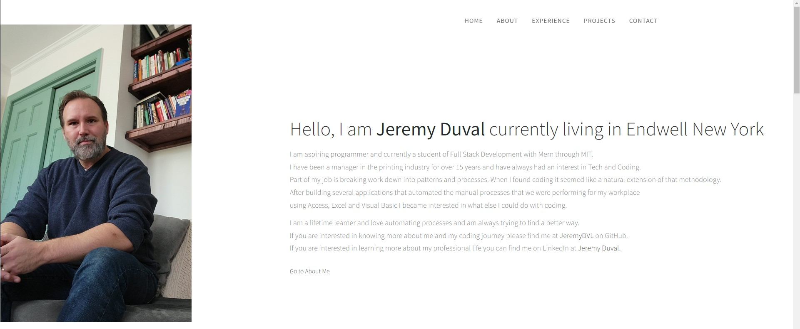

# Portfolio-Page
Personal Portfolio Website

  
  

    <a href="https://jeremydvl.github.io/Portfolio-Page/">Click Hear to View My Webpage</a>

## <ins>What it's about

It's all about me.  If you want to find out a few things about me click the link to open my page and dive in!  You will find a few 
  cool projects like moving eyes with a pointer, a mapped bus route and pacman factory along with some of my contact links.
  
## <ins>How to Run

Click the link to open the page then use the navigation bar on top to scroll through the page or just scroll through the page.  Use the  
  links to get to my Github, LinkedIn and even download my resume.

## <ins>Future improvements

There are too many future improvements to count.  Adding some animation along with better functionality and placement to make it adapt to  
  different screen sizes.  I also downloaded an older version of bootstrap and bootstap.js and was too far in to change it by the time I had realized it
  so finding a clean way to update those is on my list as well.

## <ins>License

MIT License

Copyright (c) 2022 Jeremy Duval

Permission is hereby granted, free of charge, to any person obtaining a copy
of this software and associated documentation files (the "Software"), to deal
in the Software without restriction, including without limitation the rights
to use, copy, modify, merge, publish, distribute, sublicense, and/or sell
copies of the Software, and to permit persons to whom the Software is
furnished to do so, subject to the following conditions:

The above copyright notice and this permission notice shall be included in all
copies or substantial portions of the Software.

THE SOFTWARE IS PROVIDED "AS IS", WITHOUT WARRANTY OF ANY KIND, EXPRESS OR
IMPLIED, INCLUDING BUT NOT LIMITED TO THE WARRANTIES OF MERCHANTABILITY,
FITNESS FOR A PARTICULAR PURPOSE AND NONINFRINGEMENT. IN NO EVENT SHALL THE
AUTHORS OR COPYRIGHT HOLDERS BE LIABLE FOR ANY CLAIM, DAMAGES OR OTHER
LIABILITY, WHETHER IN AN ACTION OF CONTRACT, TORT OR OTHERWISE, ARISING FROM,
OUT OF OR IN CONNECTION WITH THE SOFTWARE OR THE USE OR OTHER DEALINGS IN THE
SOFTWARE.
